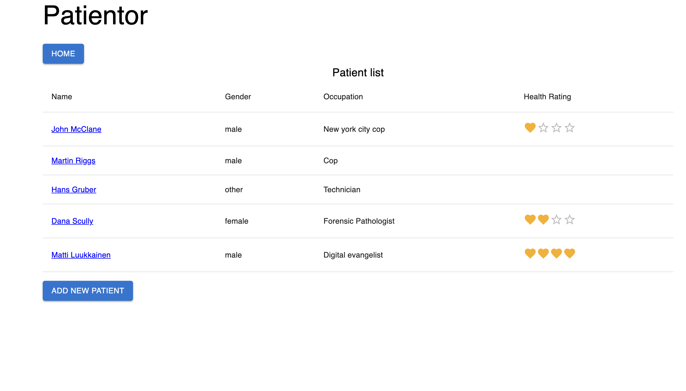
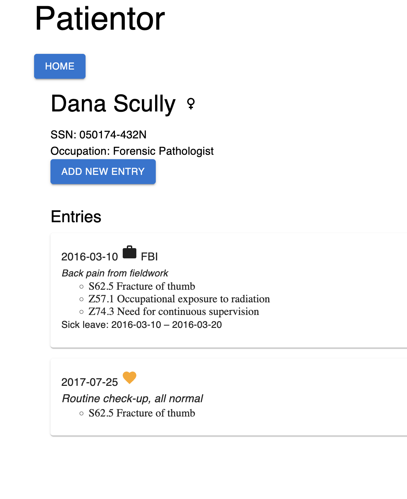
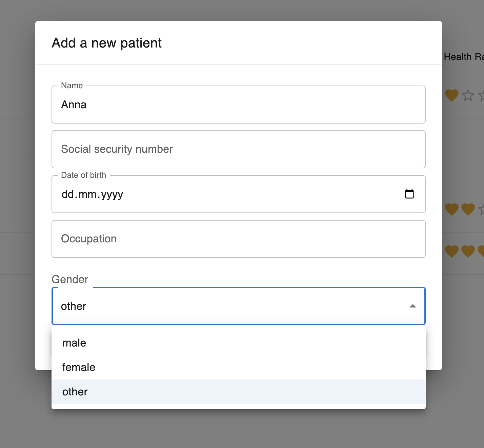
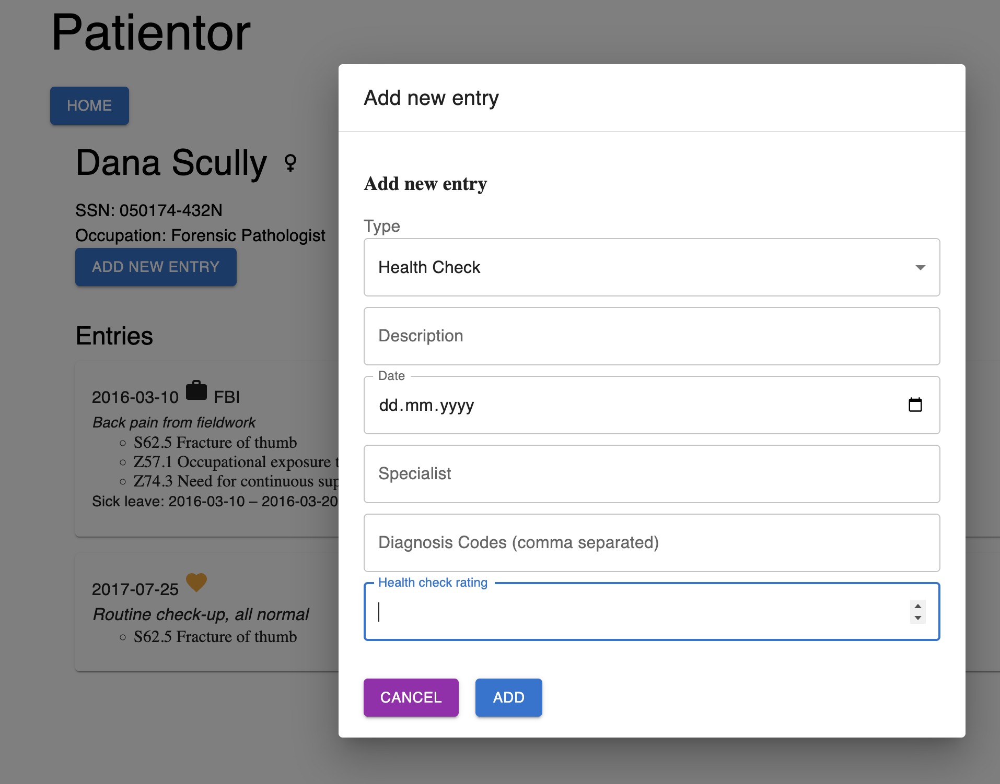

# 🏥 Patientor — Full-Stack TypeScript App

A **full-stack patient management application** built with **React + Vite** and **Node.js + Express**, focused on **strong TypeScript typing**, clean architecture, and real-world problem solving.

🌐 [**Live Demo** ](https://typescriptfs9.onrender.com/) 💻 [**GitHub**](https://github.com/Nyukaa/typescriptFS9/tree/main/tasks/task9_30/) 👩‍💻 [**Author**](https://github.com/Nyukaa)

---

## 🚀 Overview

Patientor is a simplified electronic medical record system that allows users to:

- Browse patients
- View detailed patient information
- Manage multiple medical entry types
- Add new entries with validated, type-safe forms

The project was built as part of **Full Stack Open (Part 9)** and demonstrates **production-style TypeScript usage** on both frontend and backend.

---

## 📸 Screenshots / App Preview

| Main View                                                       | Single Patient                                                                | New Patient                                                             | Add Entry                                                            |
| --------------------------------------------------------------- | ----------------------------------------------------------------------------- | ----------------------------------------------------------------------- | -------------------------------------------------------------------- |
|  |  |  |  |

---

## 🧰 Technologies Used

**Frontend**

- React + Vite
- TypeScript (strict)
- Material UI
- React Router
- Axios

**Backend**

- Node.js
- Express
- TypeScript
- Zod (runtime validation)

---

## 🧠 Problem Solving & Engineering Decisions

### 1. Complex Domain Modeling with TypeScript

- Designed **discriminated unions** for medical entries:
  - HealthCheck
  - Hospital
  - OccupationalHealthcare
- Used exhaustive `switch` checks with `never` to guarantee compile-time safety when rendering entries.

### 2. End-to-End Type Safety

- Shared and aligned types between frontend and backend.
- Prevented invalid data at compile time and runtime using **Zod schemas**.

### 3. Scalable State Management

- Local UI state handled with `useState`
- Global diagnoses data managed via **Context + useReducer**
- Clear separation between UI state and domain state.

### 4. UX-Driven Validation

- Backend validation with meaningful error messages.
- Frontend forms improved to prevent invalid input:
  - Date inputs instead of free text
  - Multi-select diagnosis codes
  - Restricted health rating values

### 5. Deployment Constraints

- Solved frontend–backend integration by:
  - Serving Vite build from Express
  - Using relative API paths (`/api`) for production
- Enabled smooth local dev via Vite proxy.

---

## ✨ Key Features

- Patient list & navigation
- Detailed patient pages
- Multiple entry types with visual distinction
- ICD-10 diagnosis code mapping
- Add new medical entries
- Type-safe forms with validation
- Clean Material UI layout

---

## 🎓 What This Project Demonstrates

- Full-stack React + Express workflow
- Advanced TypeScript usage in real applications
- Safe handling of complex data models
- Clean component and API design
- Practical problem solving under constraints
- Production-ready deployment mindset

---

⭐ This project reflects my approach to building **type-safe, maintainable, and user-focused web applications**.
